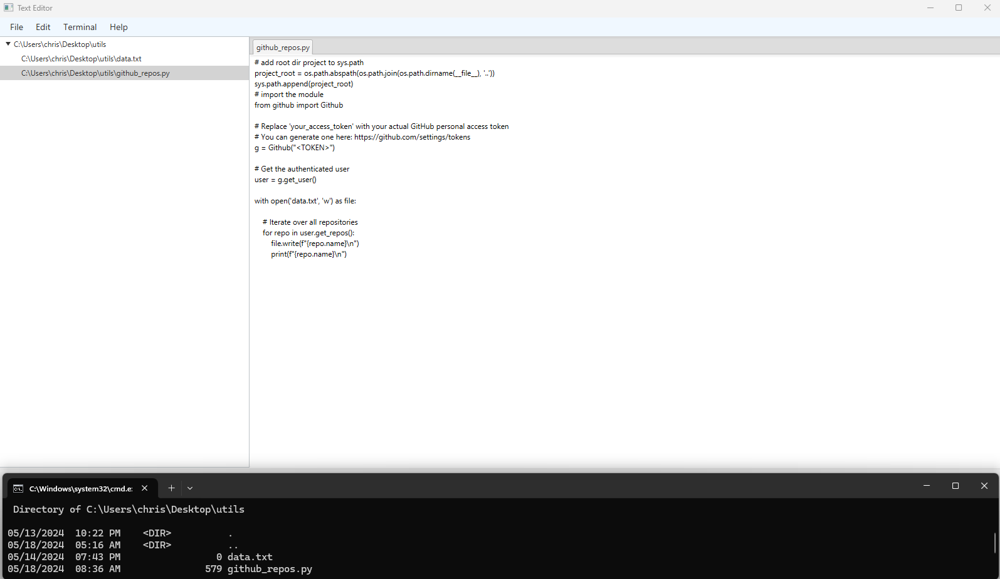

# Text Editor in Java with JavaFX

## :newspaper: About the project

This dynamic text editor, crafted with Java and JavaFX, redefines your writing experience. Seamlessly create, open, and save files with intuitive controls. Dive into a fluid browsing experience with the integrated file explorer, empowering you to effortlessly navigate folders and explore their contents. Elevate your productivity and creativity with this versatile text editing solution.

### :notebook: Features

* **Create New Files**: Easily create new text files within the editor interface.
* **Open Existing Files**: Open and edit existing text files directly from your file system.
* **Save Text Files**: Save your changes to text files with ease.
* **Browse Folders**: Navigate through folders and view their contents within the editor for seamless file management.
* **Run Programs**: Open a separate console to execute programs in the command line directly from the editor.
* **Cross-Platform Compatibility**: Enjoy the flexibility of running the editor on Windows, macOS, and Linux, thanks to its Java foundation.

## :runner: Getting started

### Installation

0. Clone this repository to your local machine:

```sh
git clone https://github.com/your-username/text-editor-in-java.git
```

1. Open the project in your favorite Java IDE (e.g., IntelliJ IDEA, Eclipse).

### Run the application

0. Download and extract [Apache Maven](https://maven.apache.org/download.cgi):

1. Navigate to the `text-editor-in-java` folder:

2. Run the following command:

```sh
C:\path\to\the\text-editor-in-java>"C:\path\to\the\apache-maven-3.9.6\bin\mvn" javafx:run
```

4.The project opens:



## :books: Resources used to create this project

* Java
    * [JDK 22 Documentation](https://docs.oracle.com/en/java/javase/22/index.html)
    * [JavaFX 17](https://openjfx.io/)
* Editor
    * [IntelliJ IDEA Community Edition](https://www.jetbrains.com/idea/download/?section=windows)
* Frameworks
  * [Apache Maven](https://maven.apache.org/download.cgi)
* Markdwon
    * [Basic syntax](https://www.markdownguide.org/basic-syntax/)
    * [Complete list of github markdown emofis](https://dev.to/nikolab/complete-list-of-github-markdown-emoji-markup-5aia)
    * [Awesome template](http://github.com/Human-Activity-Recognition/blob/main/README.md)
    * [.gitignore file](https://git-scm.com/docs/gitignore)

## :bookmark: License

This project is licensed under the terms of the [MIT License](LICENSE).

## :copyright: Copyright

See the [COPYRIGHT](COPYRIGHT) file for copyright and licensing details.
